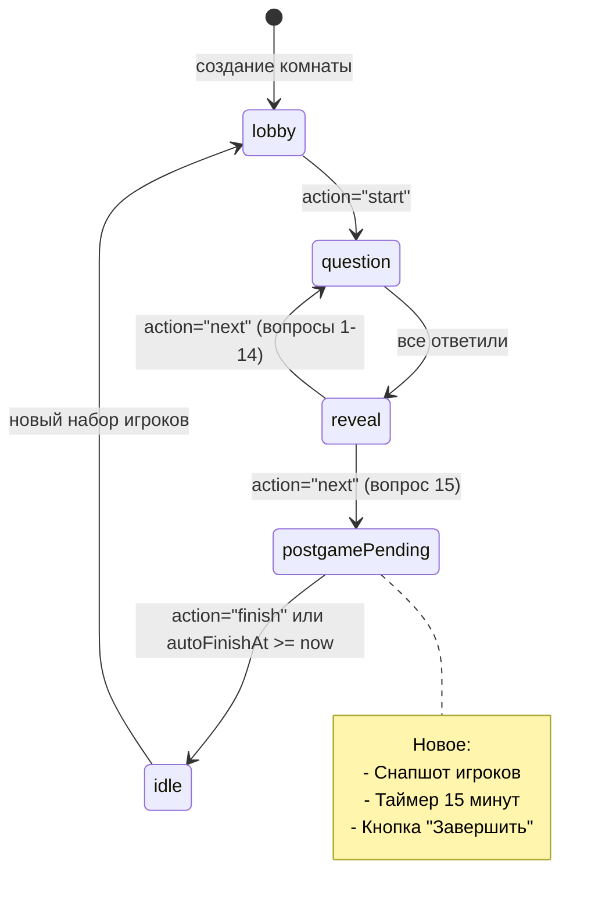
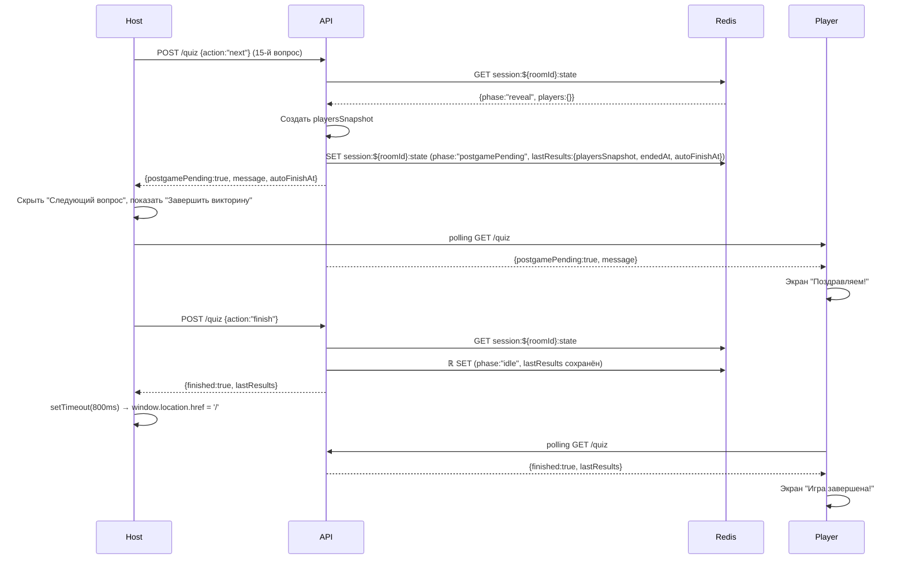

# Карта событий v251028.1

Версия: v251028.1 (тег)  
Коммит: `2f8e2cd` — "chore(release): v251028.1 changelog"  
Дата: 2025-10-28  
Предыдущая версия: v251027.1

---

## Изменения относительно v251027.1

### Ключевые отличия

1. **Новая фаза `postgamePending`** (вместо `complete`)
   - После 15-го вопроса показывается карточка с сообщением "Поздравляем!"
   - Хост видит кнопку "Завершить викторину"
   - Игроки видят экран завершения без действий

2. **Снапшот результатов с заморозкой**
   - `lastResults.playersSnapshot` — замороженные метрики игроков
   - `lastResults.endedAt` — время завершения всех вопросов
   - `lastResults.autoFinishAt` — дедлайн авто-завершения (endedAt + 15 минут)

3. **Автозавершение по таймауту**
   - Через 15 минут после 15-го вопроса игра автоматически финализируется
   - Проверка происходит при каждом GET/POST запросе к `/api/sessions/[roomId]/quiz`

4. **Стабильность UI**
   - Лобби-пуллинг останавливается при postgamePending
   - Игроки не перетираются "нулями" из /players API
   - Кнопка "Начать викторину" скрыта в постгейме
   - Используется `playersForUi` из `lastResults.playersSnapshot`

5. **Редирект ведущего**
   - По клику "Завершить викторину" → переход на `/` (каталог) через 0.8 секунды

---

## 1. Глобальные артефакты

### 1.1 ENV переменные

(Без изменений по сравнению с v251027.1)

| Переменная | Значение | Где читается |
|-----------|----------|--------------|
| `NEXT_PUBLIC_SITE_DOMAIN` | yoplix.ru (default) | Клиент/сервер |
| `NEXT_PUBLIC_BASE_URL` | Опционально | Клиент/сервер |
| `UPSTASH_REDIS_URL` | Redis URL | Только сервер |
| `UPSTASH_REDIS_TOKEN` | Redis token | Только сервер |

### 1.2 Роуты

(Без изменений)

#### UI
- `/` — главная
- `/quiz/[slug]` — описание викторины
- `/quiz/[slug]/host` — экран ведущего
- `/join/[slug]` — экран игрока

#### API
- `POST /api/sessions` — создание комнаты
- `GET /api/sessions/[roomId]` — проверка комнаты
- `GET /api/sessions/[roomId]/players` — список игроков
- `POST /api/sessions/[roomId]/players` — присоединение
- `GET /api/sessions/[roomId]/quiz` — состояние викторины
- `POST /api/sessions/[roomId]/quiz` — действия (start/answer/next/finish)

### 1.3 Модели/типы

#### Фазы сессии (изменено)

```typescript
// types/quiz.ts
export type SessionPhase = 'idle' | 'question' | 'reveal' | 'postgamePending'; // ← было 'complete'
```

#### Состояние сессии (изменено)

```typescript
// types/quiz.ts
export interface SessionState {
  roomId: string;
  slug: string;
  currentQuestionID: number | null;
  currentQuestionIndex: number;
  phase: SessionPhase;
  startedAt?: number;
  questionStartedAt?: number;
  players: Record<string, PlayerScore>;
  answers: Record<string, PlayerAnswer>;
  firstCorrectPlayerId?: string | null;
  totalQuestions: number;
  selectedQuestions: number[];
  shuffledOptions?: string[];
  
  // НОВОЕ: Снимок результатов с заморозкой
  lastResults?: {
    playersSnapshot: Record<string, PlayerScore>; // замороженные метрики
    endedAt: number;                              // когда игроки ответили на все вопросы
    autoFinishAt: number;                         // endedAt + 15 * 60 * 1000
  } | false; // false либо объект
}
```

#### Компонент Host (локальный тип)

```typescript
// app/quiz/[slug]/host/page.tsx
type SessionState = {
  phase: 'lobby' | 'idle' | 'question' | 'reveal' | 'postgamePending';
  currentQuestionID: number | null;
  players: Record<string, PlayerScore>;
  answers: Record<string, PlayerAnswer>;
  currentQuestion?: { id, question, promptText, options, comment };
  
  // НОВОЕ: совпадает с серверным
  lastResults?: {
    playersSnapshot: Record<string, PlayerScore>;
    endedAt: number;
    autoFinishAt: number;
  } | false;
};
```

### 1.4 Redis ключи

(Без изменений)

| Ключ | Тип | Описание |
|------|-----|----------|
| `session:${roomId}:state` | JSON | Полное состояние викторины (включая lastResults) |

### 1.5 Логи/консоль

Префиксы (дополнено):
- `[HOST]` — экран ведущего
- `[HOST UI]` — диагностика фазы на Host (новое)
- `[PLAYER]` — экран игрока
- `[PLAYER UI]` — диагностика фазы на Player (новое)
- `[Quiz API]` — API викторины
- `[POST players]` — API присоединения игрока
- `[JOIN]` — присоединение к игре
- `[NEXT]` — переход к следующему вопросу

---

## 2. Экран ведущего /quiz/[slug]/host

### 2.1 Компоненты и состояние

**Файл:** `app/quiz/[slug]/host/page.tsx`

```typescript
// Состояние
const [roomId, setRoomId] = useState<string>("");
const [session, setSession] = useState<SessionState | null>(null);
const [isNextQuestionLoading, setIsNextQuestionLoading] = useState(false);

// Данные
const joinUrl = useMemo(() => {
  const domain = process.env.NEXT_PUBLIC_SITE_DOMAIN || 'yoplix.ru';
  return `https://${domain}/join/${params.slug}?room=${roomId}`;
}, [params.slug, roomId]);

// Логика прегейма
const isPreGame = (s?: SessionState) => {
  if (!s) return true;
  if (s.phase === 'postgamePending') return false; // ← НОВОЕ
  return s.phase === 'lobby' || (s.phase === 'idle' && !s.currentQuestionID);
};

const showQR = isPreGame(session || undefined);

// НОВОЕ: Источник игроков для UI (стабильный снапшот в postgame)
const playersForUi = useMemo(() => {
  if (session?.lastResults && typeof session.lastResults === 'object' && 'playersSnapshot' in session.lastResults) {
    return session.lastResults.playersSnapshot;
  }
  return session?.players || {};
}, [session?.players, session?.lastResults]);

// НОВОЕ: Диагностика фазы
useEffect(() => {
  if (session?.phase) {
    console.log('[HOST UI] Rendering phase:', session.phase, { 
      currentQuestionID: session.currentQuestionID, 
      lastResults: !!session.lastResults 
    });
  }
}, [session]);
```

### 2.2 Создание комнаты (лобби)

**Триггер:** монтирование компонента  
**Файл:** `app/quiz/[slug]/host/page.tsx` (useEffect, строки ~127-180)

```typescript
// POST /api/sessions
// Body: { slug: "party-quizz" }
// Response: { ok: true, roomId: "uuid" }

// Redis: session:${roomId}:state
{
  roomId: "uuid",
  slug: "party-quizz",
  phase: "lobby",
  createdAt: Date.now(),
  currentQuestionID: null,
  players: {},
  answers: {}
}
```

**Логи:** `[HOST] Creating session for slug: party-quizz`  
**UI:** показывается QR, список игроков пуст

### 2.3 Пуллинг игроков (лобби)

**Файл:** `app/quiz/[slug]/host/page.tsx` (useEffect, строки ~182-270)

```typescript
// GET /api/sessions/[roomId]/players (каждую секунду)

// НОВОЕ: Остановка пуллинга — добавлен postgamePending
// Stop polling during game and postgame
if (session?.phase === 'question' || session?.phase === 'reveal' || session?.phase === 'postgamePending' || session?.currentQuestionID) return;
```

**Логи:** `[HOST] players {count} Array`

**НОВОЕ: Защита от перетирания игроков**

```typescript
setSession(prev => {
  // Не перетираем игроков после старта и в постгейме
  if (prev && (prev.phase === 'question' || prev.phase === 'reveal' || prev.phase === 'postgamePending')) {
    console.log('[HOST] Skipping players update - game in progress or postgame');
    return prev;
  }
  
  // ... update players только в lobby/idle
});
```

### 2.4 Кнопка "Начать викторину"

(Без изменений по логике, но обновлено условие отображения)

```typescript
// НОВОЕ: Кнопка "Начать" - только в лобби/idle
{!session?.currentQuestionID && session?.phase !== 'question' && session?.phase !== 'postgamePending' && playersArr.length > 0 && (
  <button onClick={handleStart}>Начать викторину</button>
)}
```

**Сеть:** `POST /api/sessions/[roomId]/quiz { action: "start", slug }`  
**Логи:** `[Quiz API] Game started for room ${roomId}`  
**UI:** QR скрывается, показывается первый вопрос

### 2.5 Кнопка "Следующий вопрос"

**Файл:** `app/quiz/[slug]/host/page.tsx` (handleNext, строки ~445-508)

**НОВОЕ: Условие отображения — question и reveal**

```typescript
{/* Render Next Question button for question and reveal phases */}
{(session?.phase === 'reveal' || session?.phase === 'question') && (
  <button onClick={handleNext}>
    {isNextQuestionLoading ? 'Загрузка...' : 'Следующий вопрос'}
  </button>
)}
```

**Сеть:** `POST /api/sessions/[roomId]/quiz { action: "next" }`

**Redis изменения (session:${roomId}:state):**
```typescript
// Для вопроса 15 (последний)
if (nextIndex >= state.selectedQuestions.length) {
  const now = Date.now();
  const playersSnapshot = state.players ? JSON.parse(JSON.stringify(state.players)) : {};
  
  state.phase = 'postgamePending';
  state.currentQuestionID = null;
  state.answers = {};
  state.firstCorrectPlayerId = null;
  state.lastResults = {
    playersSnapshot,    // ← ЗАМОРОЗКА
    endedAt: now,
    autoFinishAt: now + (15 * 60 * 1000),
  };
}
```

**Логи:** `[NEXT] All questions answered. Postgame pending started with snapshot`  
**UI:** кнопка "Следующий вопрос" скрывается, показывается карточка postgamePending

### 2.6 Фаза postgamePending

**Файл:** `app/quiz/[slug]/host/page.tsx` (строки ~688-699)

**НОВОЕ: Карточка завершения**

```typescript
{session?.phase === 'postgamePending' && (
  <div className="mt-8 text-center">
    <p className="text-xl font-semibold text-gray-800 mb-4">
      Поздравляем! Вы ответили на все вопросы!
    </p>
    <button
      className="px-8 py-3 bg-emerald-600 text-white rounded-xl Conference hover:bg-emerald-700 transition"
      onClick={handleFinish}
    >
      За▒ршить викторину
    </button>
  </div>
)}
```

**UI:**
- QR код скрыт (isPreGame вернёт false для postgamePending)
- Кнопка "Начать викторину" скрыта
- Список игроков стабилен (из `lastResults.playersSnapshot`)
- Без миганий и прыжков

### 2.7 Кнопка "Завершить викторину"

**Файл:** `app/quiz/[slug]/host/page.tsx` (handleFinish, строки ~73-95)

**НОВАЯ функция:**

```typescript
const handleFinish = async () => {
  if (!roomId) return;
  setIsNextQuestionLoading(true);
  try {
    const res = await fetch(`/api/sessions/${encodeURIComponent(roomId)}/quiz`, {
      method: 'POST',
      headers: { 'Content-Type': 'application/json' },
      body: JSON.stringify({ action: 'finish' })
    });
    const data = await res.json().catch(() => ({}));
    console.log('[HOST] finish response', data);
    
    if (data?.finished || data?.ok) {
      // НОВОЕ: Плавный редирект
      setTimeout(() => {
        window.location.href = '/';
      }, 800);
    }
  } catch (e) {
    console.error('[HOST] finish error', e);
  } finally {
    setIsNextQuestionLoading(false);
  }
};
```

**Сеть:** `POST /api/sessions/[roomId]/quiz { action: "finish" }`

**Redis изменения:**
```typescript
// POST finish handler
state.phase = 'idle';
state.currentQuestionID = null;
// lastResults сохраняется в Redis
```

**Ответ:** `{ finished: true, lastResults }`  
**Логи:** `[HOST] finish response`  
**UI:** через 0.8 секунды → редирект на `https://yoplix.ru`

### 2.8 Автозавершение (15 минут)

**Триггер:** polling GET /api/sessions/[roomId]/quiz или любой POST

**Автозавершение при GET:**
```typescript
// GET /api/sessions/[roomId]/quiz
if (state?.phase === 'postgamePending' && state.lastResults && 
    typeof state.lastResults === 'object' && 
    'autoFinishAt' in state.lastResults && 
    Date.now() >= state.lastResults.autoFinishAt) {
  
  state.phase = 'idle';
  state.currentQuestionID = null;
  await saveSessionState(roomId, state);
  
  return NextResponse.json({ finished: true, lastResults: state.lastResults, autoFinished: true });
}
```

**Автозавершение при POST (начало обработчика):**
```typescript
// POST /api/sessions/[roomId]/quiz (в начале)
const s0 = await getSessionState(roomId);
if (s0 && s0.phase === 'postgamePending' && s0.lastResults && 
    typeof s0.lastResults === 'object' && 
    'autoFinishAt' in s0.lastResults && 
    Date.now() >= s0.lastResults.autoFinishAt) {
  
  s0.phase = 'idle';
  s0.currentQuestionID = null;
  await saveSessionState(roomId, s0);
  
  return NextResponse.json({ finished: true, lastResults: s0.lastResults, autoFinished: true });
}
```

**Логи:** `[HOST UI] Rendering phase: idle`  
**UI:** (если хост всё ещё на странице) показываются итоги, редиректа нет

---

## 3. Экран игрока /join/[slug]

### 3.1 Извлечение roomId из URL

(Без изменений)

### 3.2 Проверка существования комнаты

(Без изменений)

### 3.3 Присоединение игрока

(Без изменений)

### 3.4 Пуллинг состояния игры

**Файл:** `app/join/[slug]/JoinPageClient.tsx` (useEffect, строки ~146-213)

**ИЗМЕНЕНО:**

```typescript
const loadCurrentQuestion = useCallback(async () => {
  if (!roomId) return;
  try {
    const res = await fetch(`/api/sessions/${roomId}/quiz`);
    if ((last res.ok) {
      const data = await res.json();
      if (data.postgamePending) {  // ← было finishedPending
        // Фаза complete: показываем финальное сообщение
        setCurrentQuestion(null);
        setShowResult(false);
        setIsSubmittingAnswer(false);
      } else if (!data.finished) {
        setCurrentQuestion(data.question);
      }
    }
  } catch {}
}, [roomId]);
```

```typescript
const checkGameStatus = useCallback(async () => {
  if (!roomId) return;
  try {
    const res = await fetch(`/api/sessions/${roomId}/quiz`);
    if (res.ok) {
      const data = await res.json();
      
      if (data.postgamePending) {  // ← было finishedPending
        setStarted(true);
        setCurrentQuestion(null);
        return;
      }
      
      if (!data.finished && data.question && !started) {
        setStarted(true);
        setCurrentQuestion(data.question);
      }
    }
  } catch (error) {
    console.error('Error checking game status:', error);
  }
}, [roomId, started]);
```

**НОВОЕ: Диагностика фазы**

```typescript
useEffect(() => {
  try {
    const phase = (currentQuestion as unknown as { phase?: string } | null)?.phase;
    if (phase) console.log('[PLAYER UI] phase:', phase);
  } catch {}
}, [currentQuestion]);
```

**Логи:** `[PLAYER UI] phase: postgamePending`  
**UI:** показывается экран "Поздравляем! Вы ответили на все вопросы!" (без кнопок)

### 3.5 Отправка ответа

(Без изменений)

---

## 4. API-контракты

### 4.1 POST /api/sessions/[roomId]/quiz — action "next"

**Изменения для 15-го вопроса:**

```typescript
if (nextIndex >= state.selectedQuestions.length) {
  const now = Date.now();
  const playersSnapshot = JSON.parse(JSON.stringify(state.players || {}));
  
  state.phase = 'postgamePending';
  state.currentQuestionID = null;
  state.answers = {};
  state.firstCorrectPlayerId = null;
  state.lastResults = {
    playersSnapshot,
    endedAt: now,
    autoFinishAt: now + (15 * 60 * 1000),
  };
  await saveSessionState(roomId, state);
  
  return NextResponse.json({
    postgamePending: true,
    message: "Поздравляем! Вы ответили на все вопросы!",
    autoFinishAt: state.lastResults.autoFinishAt,
    status: 200,
  });
}
```

**Response для других вопросов:** (без изменений)

### 4.2 POST /api/sessions/[roomId]/quiz — action "finish"

**НОВЫЙ endpoint:**

```typescript
if (action === "finish") {
  const state = await getSessionState(roomId);
  if (!state) return NextResponse.json({ error: 'Session not found' }, { status: 404 });
  if (state.phase !== 'postgamePending') return NextResponse.json({ error: 'Not in postgamePending' }, { status: 400 });
  
  state.phase = 'idle';
  state.currentQuestionID = null;
  await saveSessionState(roomId, state);
  
  return NextResponse.json({ finished: true, lastResults: state.lastResults });
}
```

### 4.3 GET /api/sessions/[roomId]/quiz

**Добавлено автозавершение:**

```typescript
if (!state || state.currentQuestionID === null) {
  // Автозавершение при GET
  if (state?.phase === 'postgamePending' && state.lastResults && 
      typeof state.lastResults === 'object' && 
      'autoFinishAt' in state.lastResults && 
      Date.now eighteen >= state.lastResults.autoFinishAt) {
    
    state.phase = 'idle';
    state.currentQuestionID = null;
    await saveSessionState(roomId, state);
    
    return NextResponse.json({ finished: true, lastResults: state.lastResults, autoFinished: true });
  }
  
  // Возврат postgamePending
  if (state?.phase === 'postgamePending') {
    return NextResponse.json({
      postgamePending: true,
      message: 'Поздравляем! Вы ответили на все вопросы!',
      autoFinishAt: state.lastResults && typeof state.lastResults === 'object' && 'autoFinishAt' in state.lastResults 
        ? state.lastResults.autoFinishAt 
        : null,
      players: state.players,
      totalQuestions: Array.isArray(state.selectedQuestions) ? state.selectedQuestions.length : 15,
      phase: state.phase,
      currentQuestionID: null
    });
  }
  
  // Возврат для idle с lastResults
  if (state?.phase === 'idle' && state.lastResults) {
    return NextResponse.json({
      finished: true,
      message: 'Викторина завершена',
      lastResults: state.lastResults
    });
  }
  
  return NextResponse.json({ finished: true, message: "No active question" });
}
```

---

## 5. Пошаговая карта событий (1-8)

### Событие 1-4: Создание комнаты, присоединение

(Без изменений)

### Событие 5: "Начать викторину"

(Без изменений в запросах, но обновлено условие кнопки)

**UI:** Кнопка показывается только если `session?.phase !== 'postgamePending'`

### Событие 6: Ответ игрока

(Без изменений)

### Событие 7: "Следующий вопрос" (вопросы 1-14)

(Без изменений)

### Событие 7.5: "Следующий вопрос" (вопрос 15 — последний)

**Экран:** `/quiz/party-quizz/host`  
**Компонент:** `HostPage` (handleNext)

**Создается:**  
- `playersSnapshot = JSON.parse(JSON.stringify(state.players))`
- `lastResults = { playersSnapshot, endedAt: now, autoFinishAt: now + 15min }`

**Передача:** onClick → handleNext() → API  
**Сеть:** `POST /api/sessions/[roomId]/quiz { action: "next" }`  
**Response:** `{ postgamePending: true, message: "Поздравляем! Вы ответили на все вопросы!", autoFinishAt: <timestamp> }`

**Redis:** `session:${roomId}:state` ← обновление:
```typescript
{
  phase: 'postgamePending',
  currentQuestionID: null,
  answers: {},
  firstCorrectPlayerId: null,
  lastResults: {
    playersSnapshot: { /* замороженные данные игроков */ },
    endedAt: 1698500000000,
    autoFinishAt: 1698500900000
  }
}
```

**UI (Host):**  
- Кнопка "Следующий вопрос" скрыта
- Карточка postgamePending с сообщением "Поздравляем!"
- Кнопка "Завершить викторину" видна
- QR код скрыт
- Список игроков из `lastResults.playersSnapshot` (стабильные цифры)

**UI (Player):**  
- Экран "Поздравляем! Вы ответили на все вопросы! Подождите завершения ведущим."
- Кнопок нет

**Логи:**  
- `[NEXT] All questions answered. Postgame pending started with snapshot`
- `[HOST UI] Rendering phase: postgamePending`

**Условия:**  
- `phase` становится `'postgamePending'`
- Игроки заморожены в снапшоте

### Событие 8A: "Завершить викторину" (ручное)

**Экран:** `/quiz/party-quizz/host`  
**Компонент:** `HostPage` (handleFinish)

**Создается:** нет  
**Передача:** onClick → handleFinish() → API  
**Сеть:** `POST /api/sessions/[roomId]/quiz { action: "finish" }`  
**Response:** `{ finished: true, lastResults: { ... } }`

**Redis:** `session:${roomId}:state` ← обновление:
```typescript
{
  phase: 'idle',
  currentQuestionID: null,
  lastResults: { /* сохранённый снапшот */ }
}
```

**UI (Host):**  
- Через 0.8 секунды → `window.location.href = '/'`
- Редирект на https://yoplix.ru

**UI (Player):**  
- Остаётся на экране завершения
- При следующем polling увидит `finished: true`

**Логи:**  
- `[HOST] finish response`
- `[HOST UI] Rendering phase: idle` (перед редиректом)

### Событие 8B: Автозавершение (15 минут)

**Триггер:** polling GET /api/sessions/[roomId]/quiz или любой POST после истечения autoFinishAt

**Сеть:** `GET /api/sessions/[roomId]/quiz`  
**Response:** `{ finished: true, lastResults: { ... }, autoFinished: true }`

**Redis:** `session:${roomId}:state` ← обновление:
```typescript
{
  phase: 'idle',
  currentQuestionID: null,
  lastResults: { /* сохранённый снапшот */ }
}
```

**UI (Host):**  
- Если хост всё ещё на странице → показываются итоги
- Редиректа нет (autoFinished)

**UI (Player):**  
- Видит экран "Игра завершена!"

**Логи:**  
- `[HOST UI] Rendering phase: idle`

---

## 6. Диаграммы

### State Machine викторины (v251028.1)



### Sequence Diagram: "Завершение викторины (postgamePending → idle)"



---

## 7. Риски и гонки

### 7.1 Race conditions

| Где | Риск | Защита (v251028.1) |
|-----|------|---------------------|
| Лобби polling (хост) | Перетирание игроков в postgamePending | Проверка фазы перед setSession: если `prev.phase === 'postgamePending'`, возвращаем `prev` без изменений |
| Ответ игрока | Дублирование ответа | `isSubmittingAnswer` флаг (без изменений) |
| Next question | Одновременные запросы | Redis Lock (`${roomId}:quiz:next`, 3000ms) (без изменений) |
| Автозавершение | Множественный перевод в idle | Проверка `lastResults.autoFinishAt >= Date.now()` атомарно при GET/POST |

### 7.2 При перезагрузке

**Хост в postgamePending:**
- `roomId` в состоянии компонента (может потеряться, но обычно восстанавливается из URL через логику монтирования)
- При следующем polling GET /quiz → увидит `postgamePending` или `idle` (если таймер истёк)
- `lastResults` в Redis → игроки из снапшота

**Хост после редиректа:**
- На странице `/` — дальнейших действий не требуется

### 7.3 Примеры запросов

```bash
# Следующий вопрос (15-й — последний)
curl -X POST https://yoplix.ru/api/sessions/UUID/quiz \
  -H "Content-Type: application/json" \
  -d '{"action": "next"}'
# Response: {"postgamePending":true,"message":"Поздравляем! Вы ответили на все вопросы!","autoFinishAt":1698500900000}

# Завершить вручную
curl -X POST https://yoplix.ru/api/sessions/UUID/quiz \
  -H "Content-Type: application/json" \
  -d '{"action": "finish"}'
# Response: {"finished":true,"lastResults":{"playersSnapshot":{...},"endedAt":1698500000000,"autoFinishAt":1698500900000}}

# GET при postgamePending
curl https://yoplix.ru/api/sessions/UUID/quiz
# Response: {"postgamePending":true,"message":"...","autoFinishAt":1698500900000,"players":{...}}

# GET после автозавершения (если таймер истёк)
curl https://yoplix.ru/api/sessions/UUID/quiz
# Response: {"finished":true,"lastResults":{...},"autoFinished":true}
```

---

## 8. Основные изменения в v251028.1

### Логика postgamePending

**Поведение:**
- После 15-го вопроса устанавливается `phase: 'postgamePending'`
- Создаётся `playersSnapshot` — немодифицируемая копия текущих метрик игроков
- Сохраняется `lastResults` с метками времени для авто-завершения

**Визуально:**
- Host: карточка "Поздравляем!" + кнопка "Завершить викторину"  
- Player: экран ожидания без действий  
- QR код не показывается  
- Кнопка "Начать викторину" скрыта

### Стабильность списка игроков

**Причина миганий в предыдущих версиях:**
- Лобби-пуллинг продолжал работать и перетирал `session.players` значениями из `/players` API (где у игроков score=0, correct=0)

**Решение (v251028.1):**
1. Лобби-пуллинг останавливается при `postgamePending`
2. В обработчике polling — проверка фазы перед setSession (если `postgamePending` → возвращаем prev без изменений)
3. Использование `playersForUi` из `lastResults.playersSnapshot` для отрисовки

### Редирект ведущего

**После клика "Завершить викторину":**
- Проверяется успешный ответ API
- Через 0.8 секунды выполняется `window.location.href = '/'`
- Результат: плавный переход на каталог викторин

### Автозавершение

**Триггеры:**
- Каждый GET /api/sessions/[roomId]/quiz
- Начало каждого POST /api/sessions/[roomId]/quiz

**Логика:**
```typescript
if (state.phase === 'postgamePending' && 
    state.lastResults && 
    'autoFinishAt' in state.lastResults && 
    Date.now() >= state.lastResults.autoFinishAt) {
  
  state.phase = 'idle';
  state.currentQuestionID = null;
  // lastResults сохраняется
}
```

**Результат:** Если хост не нажал "Завершить викторину" в течение 15 минут, игра автоматически завершается.

---

## 9. Карта трассировки (пошагово)

| Время | Экран | Событие | Запрос | Ответ | Redis | UI |
|-------|-------|---------|--------|-------|-------|-----|
| T0 | HostPage | монтирование | POST /api/sessions | `{ok, roomId}` | CREATE phase:"lobby" | QR, empty players |
| T1 | JoinPageClient | присоединение | POST /players | `{ok, player}` | APPEND players | joined=true |
| T5 | malattia HostPage | клик "Начать" | POST /quiz {start} | `{question}` | UPDATE phase:"question" | QR скрыт, вопрос 1/15 |
| ... | ... | ... | ... | ... | ... | ... |
| T300 | HostPage | клик "Следующий" (15-й) | POST /quiz {next} | `{postgamePending}` | UPDATE phase:"postgamePending", lastResults:{snapshot} | Кнопка Next скрыта, показана карточка postgame |
| T301 | Hostриковать | клик "Завершить" | POST /quiz {finish} | `{finished, lastResults}` | UPDATE phase:"idle" | Через 0.8с → редирект на / |
| T301.5 | Player | polling | GET /quiz | `{finished, lastResults}` | — | Экран "Игра завершена!" |
| T900 | HostPage | polling | GET /quiz | `{finished, lastResults}` | Если postgamePending + таймер → UPDATE phase:"idle" | Автозавершение (если хост не кликнул) |

---

## 10. Контакты

**Проект:** https://github.com/AlexAdlum/yoplix-next  
**Домен:** https://yoplix.ru  
**Версия:** v251028.1 (commit `2f8e2cd`)  
**Предыдущая:** v251027.1

**Ключевые коммиты v251028.1:**
- `2f8e2cd` — chore(release): v251028.1 changelog
- `0c5ef58` — feat(host): redirect to '/' after finish
- `ffce2f9` — fix(host,api): freeze results and stop lobby polling in postgamePending
- `f7d4e08` — feat(postgame): introduce 'postgamePending' phase with auto-finish
- `090be54` — fix(host): restore 'Следующий вопрос' in reveal
- `b109f84` — feat(quiz): introduce 'complete' phase after last question

